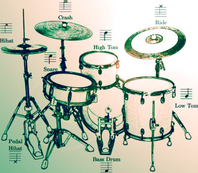

# EAR Drummer

EAR Drummer is a interactive music system that generates rhythmical drum patterns and bass lines.\
It produces midi output that provides backing music to accompany a Jazz soloist in realtime.\
It uses **E**volutionary Computing, is fully **A**utonomous and **R**eacts to midi input.

## Demo

Demo material showing EAR Drummer in action is available on [Zenodo](https://doi.org/10.5281/zenodo.5564676).

## Quick Start

EAR Drummer is implemented in pure Java.\
The easiest way of running EAR Drummer is by executing the latest Jar under [Releases](https://github.com/OysterSandwich/EAR-Drummer/releases).\
If you want to compile the project's source, it is recommended to use the [Ant](https://ant.apache.org/) build file.\
A short instruction to the GUI can be found in the *doc/* directory.

## Future Plans:

* Transformation of *RuleBased* Approach to *CombinationBased*\
(see src/init/Settings.java -> FitnessVersion.CombinationBased)\
Rules become different combinations of SoloFactors and PatternFactors

* Add more harmony instruments
